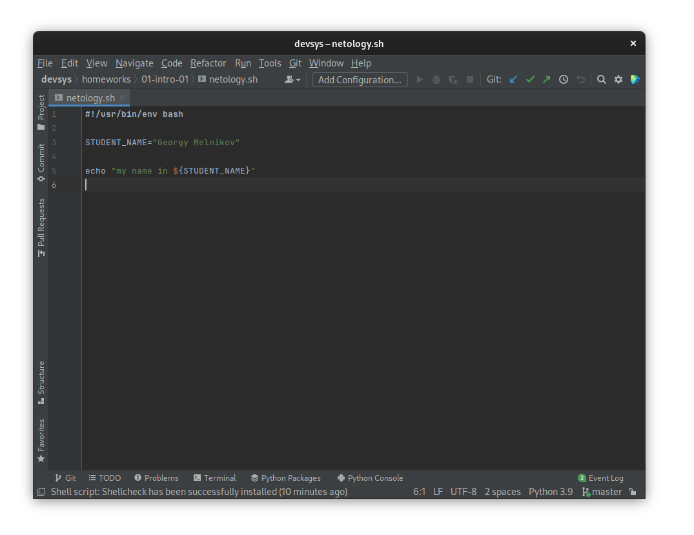

# Задание №1 - Подготовка рабочей среды

## Скриншоты

* netology.tf

* netology.sh

* netology.md

* netology.yaml

* netology.jsonnet

# Задание №2 - Описание жизненного цикла задачи (разработки нового функционала)

## Жизненный цикл задачи
Пусть от клиента приходит некая заявка через службу поддержки, и поддержка заводит тикет с задачей на разработку.

Вот примерный алгоритм ее последующей реализации:

1. Анализ.
   * Определение требований по "сырой задаче".
   * Выработка подходов для реализации задачи (при помощи разработчиков и менеджеров).
   * Определение приоритетности задачи.
   * Передача задачи на разработку менеджером.
2. Разработка.
   * Планирование продолжительности исполнения задачи (разработчик совместно с менеджером).
   * Написание кода, основанного на выработанных и задокументированных подходах из предыдущего шага.
   * Написание тестов для нового кода.
   * Статическое тестирование (на правильность синтаксиса и соответствие стилю).
   * Код-ревью.
3. Тестирование.
   * Прогон автоматических тестов для проверки системы с новым кодом в среде, которая является моделью продуктивной среды.
     * Если найдены проблемы - документирование проблемы тестировщиками, и возвращение к этапу 2 "Разработка".
   * Ручное тестирование командой QA.
     * Если найдены проблемы - документирование проблемы командой QA, и возвращение к этапу 2 "Разработка".
4. Внедрение.
   * Выкатка новой версии продукта на продуктивную среду.
   * Проверка на наличие проблем (при помощи систем мониторинга и т.д).
     * Если найдены проблемы - откатывание изменений, документирование проблемы, и возвращение к этапу 2 "Разработка".

Работа DevOps инженера (или команды DevOps инженеров) тут заключается в следующем:
   * Предоставление возможности быстро и воспроизводимо разворачивать среду разработки и тестирования.
   * Предоставление возможности автоматически создавать и редактировать инфраструктуру продуктивной среды для организации "прозрачности" в цикле разработки инфраструктуры.
     * Написание инфраструктурного кода (Описание инфраструктуры в виде кода).
     * Написание кода для систем управления конфигурацией.
     * Управление доступом через автоматическую развертку конфигурации (и отслеживание изменений через git репозиторий, например, чтобы всегда можно было увидеть кто добавил доступ к чему либо кому либо).
   * Предоставление средств для удобного проведения код-ревью.
   * Разработка инфраструктуры для автоматического тестирования кода.
   * Разработка автоматической выкатки изменений в продуктивную среду. 
   * Разработка путей для быстрой откатки изменений при возникновении проблем.

___
