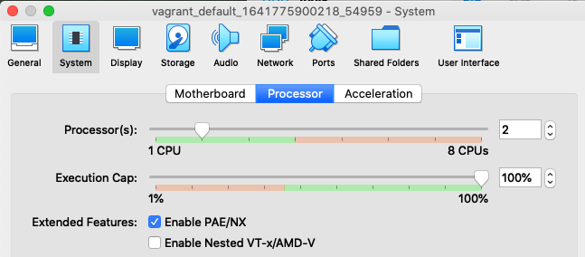
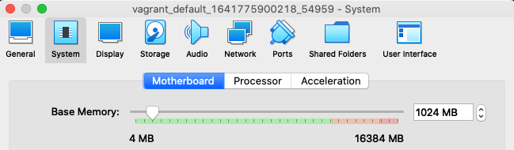
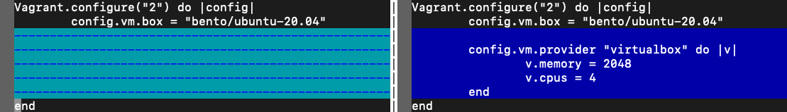

# Домашнее задание к занятию "3.1. Работа в терминале, лекция 1"
## Запускаем Ubuntu 20.04 в VirtualBox посредством Vagrant
```bash
mkdir vagrant
cd vagrant

cat > Vagrantfile << EOF
Vagrant.configure("2") do |config|
	config.vm.box = "bento/ubuntu-20.04"
end
EOF

vagrant up
```
([тык](files/vagrant-setup-vm.txt))

## Виртуальная машина со стороны VirtualBox
Vagrant создал в VirtualBox виртуальную машину с именем `vagrant_default_1641775900218_54959`

Стартовые характеристики созданной ВМ:
* CPU: 2



* MEM: 1024MB



## Как добавить оперативной памяти или ресурсов процессора виртуальной машине?
Например, мы хотим сделать машину с 4 cpu и 2048MB mem (Вместо стартовых 2 cpu и  1024MB mem).
Нужно внести следующие правки в `Vagrantfile`:

(слева файл до изменений, а справа - после)

[источник](https://www.vagrantup.com/docs/providers/virtualbox/configuration#vboxmanage-customizations)

## Знакомство с разделами `man bash`
### Какой переменной можно задать длину журнала `history`, и на какой строчке manual это описывается?

Manual page bash(1) line 846 (Указано в разделе "Shell Variables"):
```
       HISTFILESIZE
              The maximum number of lines contained in the history file.  When this variable is assigned a value, the
              history  file  is truncated, if necessary, to contain no more than that number of lines by removing the
              oldest entries.  The history file is also truncated to this size after writing it when a  shell  exits.
              If  the  value is 0, the history file is truncated to zero size.  Non-numeric values and numeric values
              less than zero inhibit truncation.  The shell sets the default value to the  value  of  HISTSIZE  after
              reading any startup files.
```

### Что делает директива ignoreboth?

```
              A  colon-separated  list of values controlling how commands are saved on the history list.  If the list
              of values includes ignorespace, lines which begin with a space character are not saved in  the  history
              list.  A value of ignoredups causes lines matching the previous history entry to not be saved.  A value
              of ignoreboth is shorthand for ignorespace and ignoredups.
```

При наличии данной директивы в листе директив в переменной окружения HISTCONTROL, в файл истории не будут сохраняться
линии, которые начинаются с пробела и линии идентичные предыдущей записи в историю.

## В каких сценариях использования применимы скобки `{}` и на какой строчке `man bash` это описано?

Manual page bash(1) line 1091:
```
Brace Expansion
       Brace  expansion  is  a  mechanism  by which arbitrary strings may be generated.  This mechanism is similar to
       pathname expansion, but the filenames generated need not exist.  Patterns to be brace expanded take  the  form
       of  an  optional preamble, followed by either a series of comma-separated strings or a sequence expression be‐
       tween a pair of braces, followed by an optional postscript.  The preamble is prefixed to each string contained
       within the braces, and the postscript is then appended to each resulting string, expanding left to right.
```

При помощи этого механизма можно например генерировать массивы аргументов для команд.

Пример:
```bash
touch {1..100000}
```
Данная команда создаст 100000 файлов с именами от 1 до 100000

Manual page bash(1) line 257:
```
       { list; }
              list is simply executed in the current shell environment.  list must be terminated with  a  newline  or
              semicolon.  This is known as a group command.  The return status is the exit status of list.  Note that
              unlike the metacharacters ( and ), { and } are reserved words and must occur where a reserved  word  is
              permitted  to be recognized.  Since they do not cause a word break, they must be separated from list by
              whitespace or another shell metacharacter.
```

Фигурные скобки позволяют запустить лист комманд в текущем окружении шелла.


## С учётом ответа на предыдущий вопрос, как создать однократным вызовом `touch` 100000 файлов? Получится ли аналогичным образом создать 300000? Если нет, то почему?
Чтобы создать 100000 файлов за одно использование touch достаточно сделать:
```bash
touch {1..100000}
```

Создать 300000 файлов за один вызов touch не получится, так как `touch {1..300000}` завершится с ошибкой:
```
-bash: /usr/bin/touch: Argument list too long
```

Эта ошибка возникает из-за того, что при распаковке `{1..300000}` получается 300000 аргументов, что превышает
максимально допустимое количество аргументов для команды. Это ограничение ядра, а именно: системного вызова `execve(2)`
```
Limits on size of arguments and environment

Most UNIX implementations impose some limit on the total size of the command-line argument (argv) and environment (envp)
strings that may be passed to a new program. POSIX.1 allows an implementation to advertise this limit using the ARG_MAX
constant (either defined in <limits.h> or available at run time using the call sysconf(_SC_ARG_MAX)). 
```

Лимит аргументов для одной программы в системе можно получить выполнив `getconf ARG_MAX`
```commandline
vagrant@vagrant:~/300th$ getconf ARG_MAX
2097152
```

## В man bash поищите по `/\[\[`. Что делает конструкция `[[ -d /tmp ]]`
Конструкция `[[ -d /tmp ]]` возвращает 0, если директория /tmp существует и 1 - если нет.

## Основываясь на знаниях о просмотре текущих (например, PATH) и установке новых переменных; командах, которые мы рассматривали, добейтесь в выводе type -a bash в виртуальной машине наличия первым пунктом в списке
```commandline
vagrant@vagrant:~/300th$ type -a bash
bash is /usr/bin/bash
bash is /bin/bash
vagrant@vagrant:~/300th$ mkdir -p /tmp/new_path_directory/
vagrant@vagrant:~/300th$ ln -s /usr/bin/bash /tmp/new_path_directory/bash
vagrant@vagrant:~/300th$ export PATH="/tmp/new_path_directory/:$PATH"
vagrant@vagrant:~/300th$ type -a bash
bash is /tmp/new_path_directory/bash
bash is /usr/bin/bash
bash is /bin/bash
```

## Чем отличается планирование команд с помощью `batch` и `at`?
at используется для назначения одноразового задания на заданное время, а команда batch — для назначения одноразовых
задач, которые должны выполняться, когда загрузка системы становится меньше 1.5 или значения в вызове atd.

## Конец
```commandline
vagrant@vagrant:~$ logout
Connection to 127.0.0.1 closed.
gmelnikov@luna vagrant % vagrant halt
==> default: Attempting graceful shutdown of VM...
gmelnikov@luna vagrant % 
```


