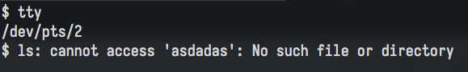
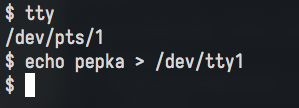

# Домашнее задание к занятию "3.2. Работа в терминале, лекция 2"

## 1. Какой тип у команды ```cd```?
Узнать, что используется в качестве команды cd в текущем окружении можно при помощи команды ```type```
```commandline
$ type cd
cd is a shell builtin
```
Как мы видим, сейчас, если мы станем вызывать ```cd```, то будет использоваться builtin.

Еще при вызове ```cd``` мог бы запускаться бинарник ```cd```, который shell бы искал в ```$PATH```, если бы builtin не был доступен.
```commandline
$ which cd
/usr/bin/cd
```

В теории, также, в окружении могла бы быть определена функция с названием ```cd```. В таком случае, shell бы запускал ее.
```commandline
$ cd() { echo fuck; }
$ type cd
cd is a function
cd ()
{
    echo fuck
}
```

Также, в окружении мог бы быть alias, который бы использовал имя ```cd```
```commandline
$ alias cd="echo pepka"
$ type cd
cd is aliased to `echo pepka'
```

## 2. Какая альтернатива без pipe команде grep <some_string> <some_file> | wc -l?
```commandline
grep -c <some_string> <somefile>
```

## 3. Какой процесс с PID 1 является родителем для всех процессов в вашей виртуальной машине Ubuntu 20.04?
В качестве init, процесса с PID 1, используется systemd.

## 4. Как будет выглядеть команда, которая перенаправит вывод stderr ls на другую сессию терминала?




## 5. Получится ли одновременно передать команде файл на stdin и вывести ее stdout в другой файл?
Да, получится.

Пример команды:
```commandline
cat < file > file2
```

Пример работы:
```commandline
$ ls
file
$ cat file
sadasdad
$ cat < file > file2
$ ls
file  file2
$ cat file2
sadasdad
```

## 6. Получится ли вывести находясь в графическом режиме данные из PTY в какой-либо из эмуляторов TTY? Сможете ли вы наблюдать выводимые данные?
В /dev/ttyX, где X -- номер tty, можно писать данные.
Например, можно открыть графический терминал и увидеть шелл (при этом будет использоваться, к примеру ```/dev/pts/1```).
Можно перенаправить stderr или stdout любой команды в /dev/ttyX (при наличии нужных прав доступа).
Переместившись в /dev/ttyX (Сtrl+Alt+fX, где X -- номер tty) можно увидеть текст, который мы перенаправили (Aльтернативно можно посмотреть содержимое файла /dev/vcsX)

Например:

```/dev/pts/1```



```/dev/tty1```


## 7. Выполните команду bash 5>&1. К чему она приведет? Что будет, если вы выполните echo netology > /proc/$$/fd/5? Почему так происходит?
Выполнив команду `bash 5>&1` мы получаем shell, в котором данные, которые будут писаться в файловый дескриптор 5 -- будут
записываться в тот же файл, с которым ассоциирован файловый дескриптор 1.
Т.е мы фактически сделали еще один файловый дескриптор для stdout.

Переменная, к которой мы обращаемся посредством ```$$``` -- содержит в себе PID текущего процесса shell (по крайней мере
для bash это так).

Если выполнить ```echo netology > /proc/$$/fd/5```, то мы увидим в выводе в терминал ```netology```.
Это происходит потому что, учитывая сказанное выше, это является эквивалентом того, если бы мы просто запустили ```echo netology```


## 8. Получится ли в качестве входного потока для pipe использовать только stderr команды, не потеряв при этом отображение stdout на pty?
Да.

```commandline
$ ls -l asdasdasdasd 3>&1 2>&3 1>&2
ls: cannot access 'asdasdasdasd': No such file or directory
```

```commandline
$ ls -l asdasdasdasd 3>&1 2>&3 1>&2 | grep -v No
$ 
```

## 9. Что выведет команда cat /proc/$$/environ? Как еще можно получить аналогичный по содержанию вывод?
Выведет все текущие переменные окружения.
Такой же вывод можно получить при помощи ```env -0```

## 10. Используя man, опишите что доступно по адресам /proc/<PID\>/cmdline, /proc/\<PID>/exe.

```
       /proc/[pid]/cmdline
              This read-only file holds the complete command line for
              the process, unless the process is a zombie.  In the
              latter case, there is nothing in this file: that is, a
              read on this file will return 0 characters.  The command-
              line arguments appear in this file as a set of strings
              separated by null bytes ('\0'), with a further null byte
              after the last string.
```

/proc/<PID>/cmdline содержит полную командную строку процесса (исполняемый файл и все аргументы)

```

       /proc/[pid]/exe
              Under Linux 2.2 and later, this file is a symbolic link
              containing the actual pathname of the executed command.
              This symbolic link can be dereferenced normally;
              attempting to open it will open the executable.  You can
              even type /proc/[pid]/exe to run another copy of the same
              executable that is being run by process [pid].  If the
              pathname has been unlinked, the symbolic link will contain
              the string '(deleted)' appended to the original pathname.
              In a multithreaded process, the contents of this symbolic
              link are not available if the main thread has already
              terminated (typically by calling pthread_exit(3)).
```

```/proc/<PID>/exe``` является символьной ссылкой на исполняемый файл процесса с PID <PID>. 

## 11. Узнайте, какую наиболее старшую версию набора инструкций SSE поддерживает ваш процессор с помощью ```/proc/cpuinfo```
Процессор хоста, на котором запущена ВМ поддерживает ```sse4_2``` 

## 12. При открытии нового окна терминала создается новая сессия и выделяется pty. Почему ssh <хост> 'tty' выводит 'not a tty'
Команда ```tty``` выводит имя терминала, который присоединен к stdin. При таком вызове команды через ssh не используется
интерактивный режим, и, как следствие, команда исполняется без управляющего терминала.


## 13. Бывает, что есть необходимость переместить запущенный процесс из одной сессии в другую. Попробуйте сделать это, воспользовавшись reptyr. Например, так можно перенести в screen процесс, который вы запустили по ошибке в обычной SSH-сессии.
Запускаем top в обычной ssh сессии. Создаем скрин ```screen -S top```. Далее: ```reptyr <пид top>```. Теперь top у нас в скрине 🎉🎉🎉.

## 14. sudo echo string > /root/new_file не даст выполнить перенаправление под обычным пользователем, так как перенаправлением занимается процесс shell'а, который запущен без sudo под вашим пользователем. Для решения данной проблемы можно использовать конструкцию echo string | sudo tee /root/new_file. Узнайте что делает команда tee и почему в отличие от sudo echo команда с sudo tee будет работать.
```tee``` копирует содержимое stdin в stdout (при этом может писать еще содержимое stdin в какой-либо файл или несколько файлов).

В первом случае перенаправлением занимается непривилегированный shell, а во втором случае в файл пишет привилегированный
tee. Поэтому в первом случае мы получаем ошибку, указывающую на недостаток привилегий, а во втором случае все ок.